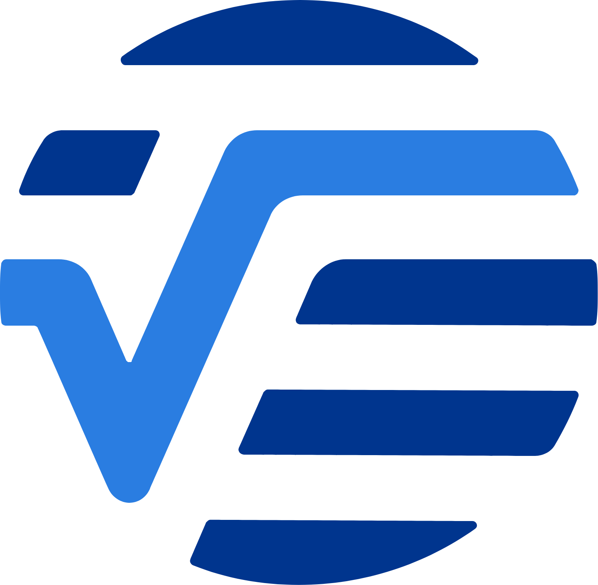

+++
title = "Resume"
# ToDo: Update PDF resume to include meta role, then add link to pdf
+++

## Work Experience

###  Meta

*Software Engineer \| New York, NY \| April 2024 - Present*
* Full stack development on Central Product Foundations team

###  Amount Small Business 

*Lead Software Engineer \| New York, NY (Remote) \| May 2022 - April 2024*
* Lead a team of 3 to 5 backend engineers responsible for delivering core platform features on time
* Architect scalable and high-performance solutions to satisfy business requirements within the scope of Amount’s rapidly evolving white label credit origination platform
* Collaboratively led multiple key technology improvement initiatives, including the migration to using Temporal for workflow orchestration resulting in improved efficiency, visibility, and resiliency
* Serve as the SME for critical microservices written in Java and Go, taking ownership of their design, development, and ongoing enhancements
* Remain involved in hands-on development of these systems when possible

*Senior Software Engineer \| New York, NY (Remote) \| February 2022 - May 2022*
* Backend web development using Java and Golang in a microservices architecture
* Integration with AWS services (EC2, ActiveMQ, Redis, Postgres, ElasticSearch)
* Ownership of various platform features from early design phase to production deployments and meeting deadlines and deliverables throughout the process

*Software Engineer \| New York, NY (Remote) \| January 2020 - February 2022*
* Backend web development using Java and Golang in a microservices architecture
* Previously worked on a .NET team doing full stack development deployed on Azure infrastructure

Amount Small Business was previously known as Linear Financial Technologies and Fundation Group LLC.
Now a part of Amount, my role has been carried through from Fundation, to Linear, to Amount.

###  Verisk Analytics

*Software Developer \| Jersey City, NJ \| August 2018 - January 2020*
* Full stack web development and batch processing using .NET Framework, .NET Core, AngularJS, and Java
* Integration with AWS services (EC2, Batch, Lambda, SQS, API Gateway, ElasticSearch)

###  New Concepts for Living

*Software Consultant \| Rochelle Park, NJ \| June 2018 - June 2019*
* Full stack web development and batch processing using .NET Core and Angular 7

###  United Parcel Service (UPS)

*Human Resources Analytics Co-op \| Timonium, MD \| September 2017 - January 2018*
* Full stack web development using .Net Web Forms

*Consumer Technology Quality Assurance Co-op \| Parsippany, NJ \| July 2017 - September 2017*
* Designed and executed test cases for widely used international shipping application

*Human Resources Intern \| Mahwah, NJ \| May 2016 - February 2017*

## Technical Skills

**Proficient In**: Java (Spring, Micronaut), Golang, C# (.NET), Javascript, SQL, Git

**Experience With**: AWS, Kubernetes, Jenkins, Python, NoSQL

**Interested In**: Blockchain, Machine Learning

## Education

###  Loyola University Maryland

*Baltimore, MD \| Class of 2018*
* Bachelor of Science, Magna Cum Laude, Computer Science
* Minors in Mathematics, Information Systems
* Presidential Scholar
* Upsilon Pi Epsilon (UPE) Computer Science Honor Society

###  Bergen Catholic High School

*Oradell, NJ \| Class of 2014*
